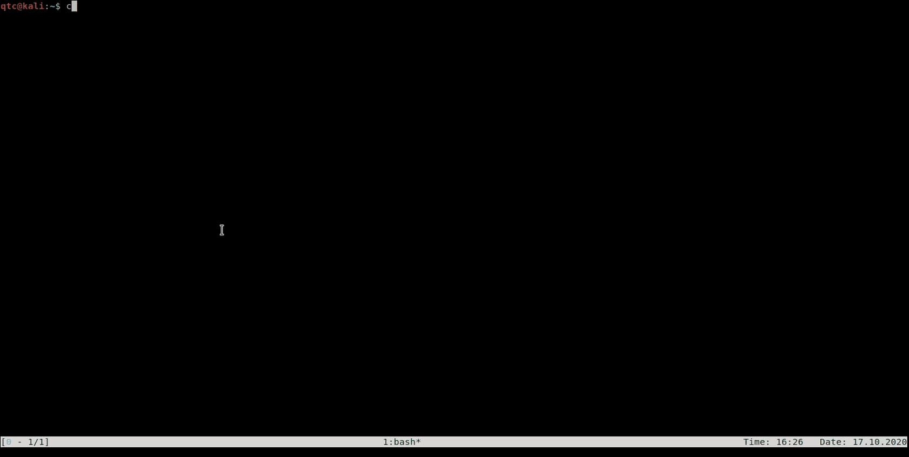

### Container Arsenal

----

*container-arsenal* (*car*) is a collection of *docker containers* that have been proven to be useful during
security assessments and *CTFs*. Each container is represented by a *docker-compose* file and its corresponding
resources. Additionally, container arsenal ships a *python* script that can be used to manage the containers.





### Description

-----

During a security assessment it is often required to install additional services on your local machine.
Some common examples include:

* *FTP* server to provide a payload that can be loaded via *XXE* attacks.
* *SMB* share to allow file sharing with *Windows* machines.
* *WebDaV* server to allow easy file uploads from a remote host.
* *SSH* server to forward ports and setup tunnels.
* *AJP* proxy server to connect to *tomcat's JSERV* ports.
* [...]

*Docker* has become more and more popular among security professionals. To be honest, I think a lot of people
overdo it a little bit when they start to run everything inside a dedicated container. However, for the services
mentioned above, *Docker* seems to be ideal to get an easy manageable solution.


### Installation

-----

*car* can be build and installed as a *pip package*. The following command installs *car* for your current user profile:

```console
$ pip3 install container-arsenal
```

You can also build *car* from source by running the following commands:

```console
$ git clone https://github.com/qtc-de/container-arsenal
$ cd container-arsenal
$ python3 setup.py sdist
$ pip3 install dist/*
```

Additionally, *car* ships a [bash-completion](./car/resources/bash_completion.d/car) script.
The completion script is installed automatically, but relies on the [completion-helpers](https://github.com/qtc-de/completion-helpers)
package. If *completion-helpers* is already installed, autocompletion for *car* should
work after installing the *pip* package. Otherwise, you may need to copy the completion script manually:

```console
$ cp car/resources/bash_completion.d/car ~/.bash_completion.d
```

### Example Workflow

-----

Consider you need to exchange files with a *Windows workstation* and want to open a fast and reliable *SMB* share.
In such a situation, you would just use ``car run samba`` to start the *samba container* of *container-arsenal*:

```console
[qtc@kali container-arsenal]$ car run samba
[+] Environment Variables:
[+]	car_local_uid                 1000
[+]	car_samba_folder              /home/qtc/arsenal/samba
[+]	car_public_folder             /home/qtc/arsenal/samba/public
[+]	car_private_folder            /home/qtc/arsenal/samba/private
[+]	car_smb_port                  445
[+]
[+] Running: sudo -E docker-compose up
Creating network "samba_default" with the default driver
Creating car.samba ... done
Attaching to car.samba
car.samba    | [+] Creating default user...
car.samba    | [+] Adjusting volume permissions...
car.samba    | [+] No password was specified.
car.samba    | [+] Generated random password for user 'default': U7uTQsdY
car.samba    | [+] Starting samba service.
```

During the startup, the container creates a dedicated user account and displays the corresponding username and
password. These are required for the *private* share that is exposed by the container. The *public* share can be
accessed without credentials:

```console
C:\Users\qtc>echo hi > test.txt
C:\Users\qtc>copy test.txt \\192.168.42.124\public\test.txt
        1 file(s) copied.
```

On your local machine, you can find the transferred file within a dedicated folder:

```console
[qtc@kali ~]$ ls arsenal/samba/
private  public
[qtc@kali ~]$ ls -l arsenal/samba/public/test.txt
-rw-rw-r-- 1 qtc qtc 5 Oct 17 15:36 arsenal/samba/public/test.txt
```

If you want to learn more about the different containers of *container-arsenal*, just check the corresponding
documentation as referenced by the next section.


### Available Containers

-----

The following paragraph lists all currently available containers of the *container-arsenal*. Notice that each container folder contains a
dedicated *README.md* where you can find more specific information about the corresponding container. Just click on the links listed
below:

* [ajp](car/resources/containers/ajp) - *AJP* proxy server to access *JSERV* ports via *HTTP*.
* [ftp](car/resources/containers/ftp) - *vsftpd* server that allows authenticated and anonymous access.
* [h2b](car/resources/containers/h2b) - A *http-to-binary* proxy that allows accessing *non-HTTP* services using *HTTP* focussed tools.
* [mysql](car/resources/containers/mysql) - Just a *MySQL* server with randomly generated password protected user accounts.
* [neo4j](car/resources/containers/neo4j) - Plain *Neo4j* database. Useful for tools like *BloodHound*.
* [nginx](car/resources/containers/nginx) - *nginx* server with *WebDAV* enabled. Supports *HTTP* and *HTTPS*.
* [samba](car/resources/containers/samba) - *Samba* share that supports authenticated and anonymous access.
* [ssh](car/resources/containers/ssh) - *SSH* server with randomly generated user account. Remote port-forwarding is enabled.
* [tftp](car/resources/containers/tftp) - A simple *tftp* server for *UDP* based file exchange.


### Configuration

-----

After installing the *container-arsenal*, a configuration file will be placed at ``~/.config/car/car.toml``.
This configuration file contains default mappings for the provided containers. The configuration for the
**samba** container looks for example like this:

```toml
[containers]
  sudo_required = true
  volume_base_path = "~/arsenal"

  [...]

  [containers.samba]
  samba_folder = "<@:BASE:@>/samba"
  public_folder = "<@:BASE:@>/samba/public"
  private_folder = "<@:BASE:@>/samba/private"
  nb_port= "139"
  smb_port = "445"
```

As you can see, the configuration file does specify a *volume_base_path*, which is by default set to ``~/arsenal``.
This is there your container volumes will be stored. The individual locations for the volumes are configured
in the different container sections. The above *samba* container will run with two volumes that will be mapped
to ``~/arsenal/samba/public`` and ``~/arsenal/samba/private``.

The top level folder ``~/arsenal/samba`` is also included in the configuration file, but will not be mapped into
the container. Each container needs a top level folder definition with the naming scheme ``<CONTAINER_NAME>_folder``.
*car* needs this top level folder information for managing resources and permissions. For containers that do not
require subfolders, like the **ssh** container, a top level folder is even sufficient.

Internally, the folder definitions from the ``cat.toml`` file are just included into the ``docker-compose.yml``
file of the corresponding container. The ``docker-compose.yml`` of the **samba** container looks like this:

```yml
version: '3.7'

services:

  car.samba:
    container_name: car.samba
    image: car/samba
    build: .
    environment:
      LOCAL_UID: ${car_local_uid}
    volumes:
      - ${car_public_folder}:/share/public
      - ${car_private_folder}:/share/private
      - ./scripts/start.sh:/scripts/start.sh
      - ./config/smb.conf:/config/smb.conf
    ports:
      - "${car_smb_port}:445"
```

If you want persistent configuration changes, the ``car.toml`` file is the correct location to make these. However,
sometimes you want only some quick changes that only apply for one particular situation. In this case, *mirroring* is the
recommended solution. As an example, imagine that you need the *ssh container* that listens on port ``2222`` instead of ``22``.
In this case, the first step is to *mirror* the *ssh container*:

```console
[qtc@kali ~]$ car mirror ssh
[+] Copying base folder of container ssh to current working directory.
[+] Done.
[qtc@kali ~]$ ls -l ssh/
total 32
-rw-r--r-- 1 qtc qtc  408 Oct 17 15:31 Dockerfile
-rw-r--r-- 1 qtc qtc 4547 Oct 17 15:31 README.md
drwxr-xr-x 2 qtc qtc 4096 Oct 17 15:31 config
-rw-r--r-- 1 qtc qtc  393 Oct 17 15:48 docker-compose.yml
-rw-r--r-- 1 qtc qtc  180 Oct 17 15:31 env_info.txt
drwxr-xr-x 2 qtc qtc 4096 Oct 17 15:31 scripts
-rwxr-xr-x 1 qtc qtc  913 Oct 17 15:31 toggle-root.sh
```

As you can see, *mirroring* just copies the directory of the corresponding *docker container* to your current working directory. Inside
this directory you can find all files that were used for the container configuration. Inside the ``docker-compose.yml``
file, all environment variables that were mentioned before, are replaced by their default values. A mirrored ``docker-compose.yml``
looks therefore like this:

```yml
version: '3.7'

services:

  car.ssh:
    container_name: car.ssh
    image: car/ssh
    build: .
    environment:
      ENABLE_ROOT: 0
      LOCAL_UID: ${car_local_uid}
    volumes:
      - /home/qtc/arsenal/ssh:/home/default
      - ./scripts/start.sh:/scripts/start.sh
      - ./config/sshd_config:/etc/ssh/sshd_config
      - ./config/sshrc:/etc/ssh/sshrc
    ports:
      - "22:22"
```

If you want to apply your custom port change now, you can simply modify the mapping inside the ``docker-compose.yml`` and then run
``car run .`` from within the *mirrored* folder.


### About Sudo

----

By default, *container-arsenal* uses ``sudo`` to invoke all docker relevant commands. This is probably not required
when being part of the *docker-group*. In these cases, you can apply the following setting within your ``car.toml``
configuration file:

```console
[qtc@kali ~]$ head ~/.conf/car/car.toml
[containers]
  sudo_required = false
  [...]
```

When running with ``sudo_required=true``, each *docker-command* is prefixed with ``sudo -E``. The ``-E`` switch
for ``sudo`` is used to inherit all environment variables of the parent process and is normally not recommended
(as probably unwanted environment variables are inherited too). However, in the case of *container-arsenal* the
command in executed from within a dedicated environment, that just contains container relevant environment variables.
Therefore, this should not be an issue.

Usage of ``sudo -E`` might be forbidden for users that are only able to run certain commands with ``sudo``. *container-arsenal*
assumes that you are able to run ``(ALL)`` commands as sudo, as in this case the following applies:

> SETENV and NOSETENV
> These tags override the value of the setenv option on a per-command basis. Note that if SETENV has been set for a command,
> the user may disable the env_reset option from the command line via the -E option. Additionally, environment variables set
> on the command line are not subject to the restrictions imposed by env_check, env_delete, or env_keep. As such, only trusted
> users should be allowed to set variables in this manner. If the command matched is ALL, the SETENV tag is implied for that command;
> this default may be overridden by use of the NOSETENV tag.

If you are only allowed to launch ``docker`` via ``sudo``, you should think about your configuration, as being able to run ``docker``
is usually almost equivalent to full *root* access to the system.


### Acknowledgements

-----

When creating the containers for this project I looked on many different repositories for useful *Dockerfiles*. Certain parts of the *Dockerfiles*
provided inside this repository are probably very similar to others that can be found on *GitHub*. I did not wrote down all the references,
but if you think that your name should be listed here, feel free to contact me :)

For all others I want to say thank you for making your work open source <3

*Copyright 2020, Tobias Neitzel and the container-arsenal contributors.*
